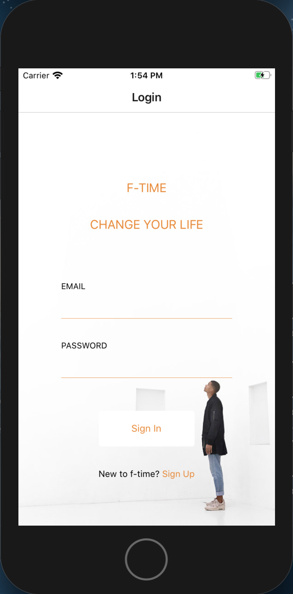
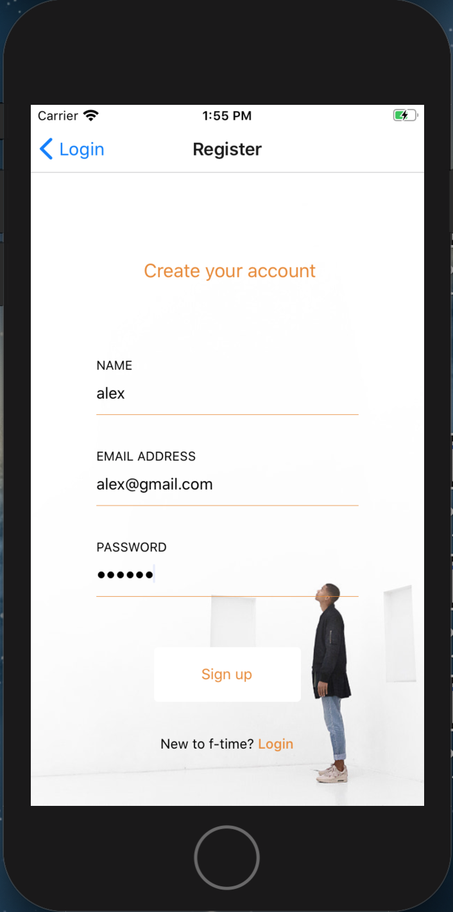
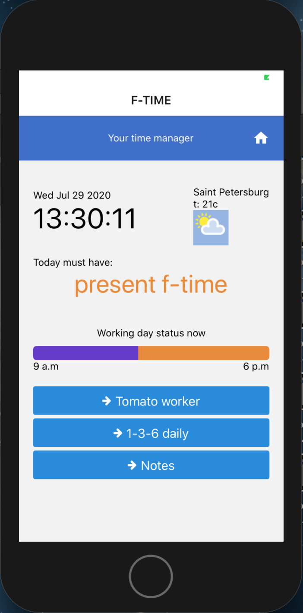
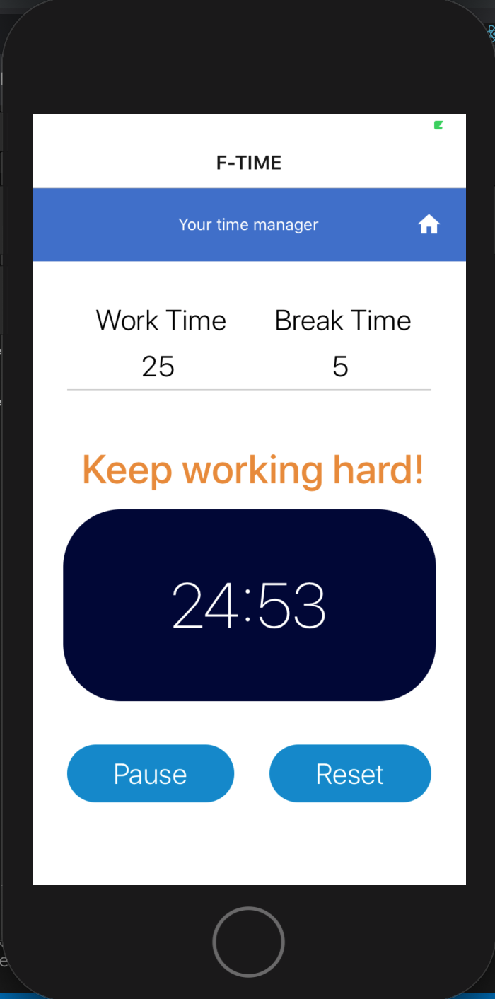
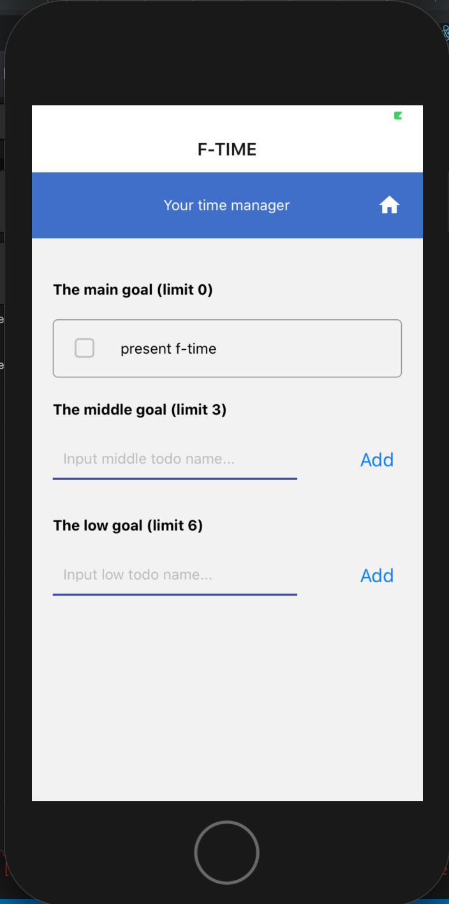
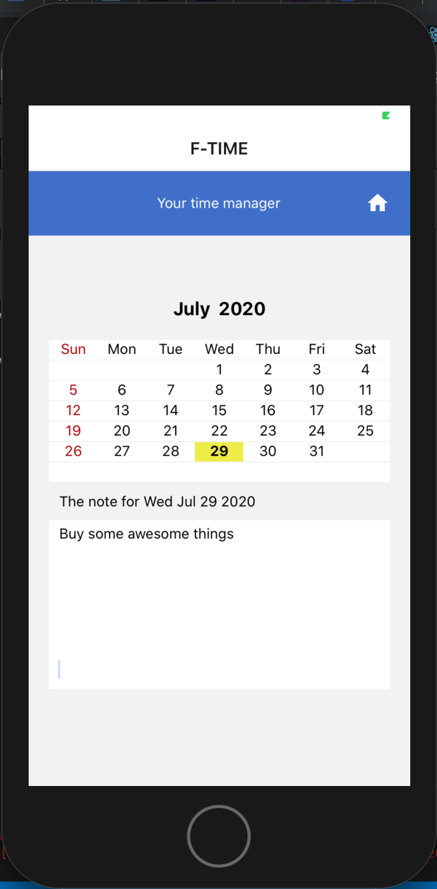

<h1> <strong> F-TIME </strong> </h1> 
  <h3>Your personal time manager</h3>
   v 1.0

  

<h4><strong>Над проектом работали: </strong></h4>
<ul>
<li>Максим Шевченко</li>
<li>Евгений Константинов</li>
<li>Максим Гиленко</li>
<ul>

<h4> <strong> Что это? </strong></h4>

Мобильное приложение для повышения личной эффективности.

<h4> <strong> Зачем? </strong></h4>

Цель: повысить личную продуктивность в рабочее время с помощью лучших мировых практик тайм-менеджмента 

<h4> <strong> Подробнее </strong> </h4>
<ul><li>48% - средняя продуктивность в рабочее время</li>
<li> 34% времени - мессенджеры, почта, youtube и т.д.</li>
<li> 18% - восстановление концентрации и вовлеченности в работу </li></ul>

Это подтверждённая статистика

 Приложение F-TIME позволяет полностью сконцентрироваться на своих текущих задачах и выжимать максимум из своего рабочего времени. А значит становиться ближе к своей собственной мечте, повышению на работе и просто к прогрессу в личной самодисциплине. 

<h4> Что полезного в приложении? </h4>
<ul><li>1-3-5 - постановка целей на день</li>

Популярная методика предлагает поставить одну большую цель, вокруг которой строится Ваш день. Три средних цели и пять маленьких. 

<li>Томато тайминг</li>

 Известная мировая техника Pomodoro или "Система Томато", предлагает нам максимально сосредоточится на своей задаче в течении 25 минут. После этого 5 минут расслабиться и снова взять 25 минутный интенсив. 4 цикла 25/5, далее 30 минутный отдых. 

<li>Fresh or Fried</li>

Fresh or Fried переводится как «Свежий или жареный». Эта философия говорит о том, что когда вы просыпаетесь утром, ваш мозг «свежий», но с течением дня он «поджаривается». А значит, вы должны определить время своего пика продуктивности и успеть сделать за этот период всё самое важное за день.Этот подход реализован в виде линии на главной странице, которая в течении дня постепенно иссякает, напоминая нам о том, что ресурс мозга не вечен.

<li>Календарь</li>

Интеррактивный календарь заметок, позволяющий нам делать записи о текущих делах, идеях и прочем. Минималистично простой и эффективный инструмент.

<li> Погода и время </li>

 Небольшой бонус для того, чтобы погода не стала неожиданной преградой к построению планов

</ul>

<h4> <strong> Какие технологии использовали? </strong> </h4>

<h4> React Native </h4>
<h4> Firebase </h4>
<h4> Expo </h4>
<h4> Weater Api </h4>

<h4> <strong> Как запустить ? </strong></h4>
<ul>
<li> Клонируйте репозиторий на свой компьютер </li>
<li> Воспользуйтесь командой: </li>
     
    
npm install 

    
npm start 

<li> Скачайте EXPO в App Store или Google Play на своём телефоне </li>
<li> Запустите приложение по QR коду или скачайте эмулятор Iphone/Android на свой компьютер </li>
</ul>

<h4> <strong> Скриншоты Jobble </strong></h4>

  

  

  

  

  

<h4> Спасибо, что посмотрели наше приложение! Хорошего дня! =) </h4>

